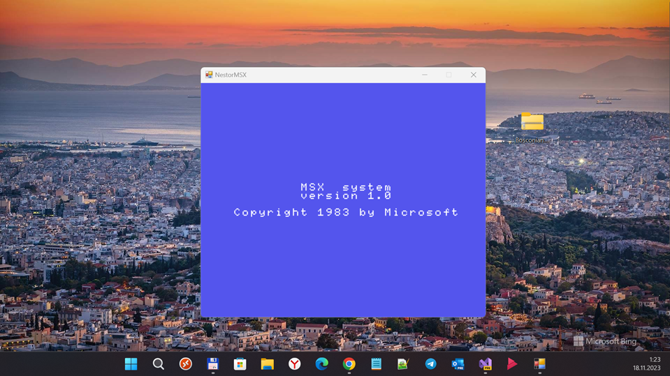
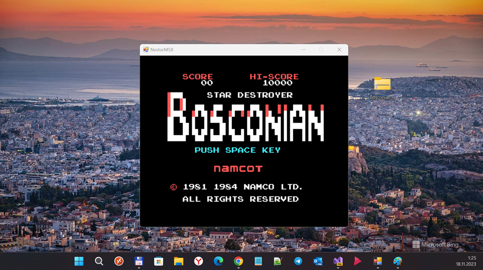
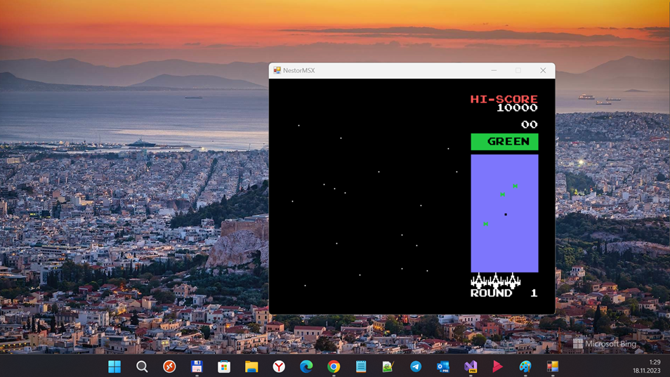

# NestorMSX #

My fork of [NestorMSX](https://github.com/Konamiman/NestorMSX) project.

## What is this? ##

NestorMSX is a very simple, incomplete (but extensible via plugins), underperforming MSX emulator. It was originally developed with the purpose of serving as an example of an emulation environment built around [the Z80.NET package](https://github.com/Konamiman/Z80dotNet). It is written in C# and targets the .NET Framework 4 Client Profile.

**[Here is the plugin development guide](PluginDevelopmentGuide.md)** in case you were searching for it, by the way.

## Screenshots ##

## What does it emulate? ##

The base emulated machine is a MSX2 computer with a keyboard and a text-only display (only SCREEN 0 and SCREEN1, without sprites, are emulated). And that's it: there is no emulation for sound, cassette, joystick, printer or any other hardware.

However, NestorMSX comes with a plugin system that allows to extend it to emulate additional hardware or to provide some nice extras (see the copy & paste plugin for example). NestorMSX comes with the following built-in plugins:

- Clock IC chip (date and time are took from the host machine's clock)
- Copy & paste from/to the host machine clipboard (text only)
- Plain RAM (size from 1 byte to 64K)
- Plain ROM (size from 1 byte to 64K)
- Standard mapped RAM
- MegaROM mappers: ASCII8 and ASCII16
- MSX-DOS and Nextor (with disk images)
- A special Disk BASIC that integrates with the host filesystem

Notice how the different memory types are implemented via plugins. Actually, the core NestorMSX emulated components are just the VDP, the keyboard and the slots system; everything else is handled via plugins.

## How to use ##

1. Review the `NestorMSX.config` file and tweak it if appropriate. Each configuration key is appropriately (I hope!) explained.
2. Take a look at the `machines` directory. Each subdirectory here contains a `machine.config` file that holds a machine definition. The file for the _MSX2 with Nextor_ machine is fully annotated, take a look at it to understand how to create new machines or modify existing ones.
3. Run `NestorMSX.exe`. The first time you will be asked to choose a machine. You can run a different machine via the appropriate menu option or via command line switch (see "Help" within NestorMSX itself).

**NOTE:** Since only text modes are emulated, you will not see the MSX logo at startup. Instead, you will go directly to the BASIC/DOS/Nextor prompt after a few seconds.

To emulate a MSX1 machine, just use MSX1 ROMS and set the VRAM size to 16K (and disable the clock IC plugin too if you want). It will be a MSX1 with V9938, though.

## Plugins ##

NestorMSX comes with a nice set of built-in plugins. Take a look at the _NestorMSX.config_ and _machine.config_ files to get an idea of how they work, then see the [Built-in plugins reference](BuiltInPluginsReference.md) for details.

If you are a developer and want to build your own plugins, take a look at the [Plugin development guide](PluginDevelopmentGuide.md).

## Known problems ##

- Poor performance
- Inexact timing
- Uber ugly application icon
- The "Reset" menu entry often does not work

## Future plans ##

- Partial emulation of graphic modes (to run MultiMente and similar tools)
- Develop a state-of-the-art debugger

## Last but not least...

...if you like this project **[please consider donating!](http://www.konamiman.com/msx/msx-e.html#donate)** My kids need moar shoes!

## Reference(s) ##

- [Konamiman, the MSX freak](http://www.konamiman.com). No more, no less.

## ..
As is. No support. RnD only.

## .
[m][e] 2023